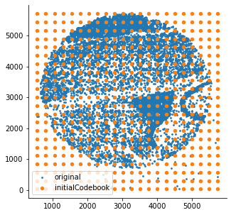
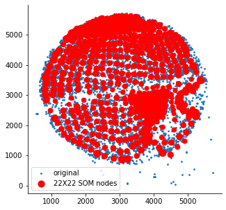
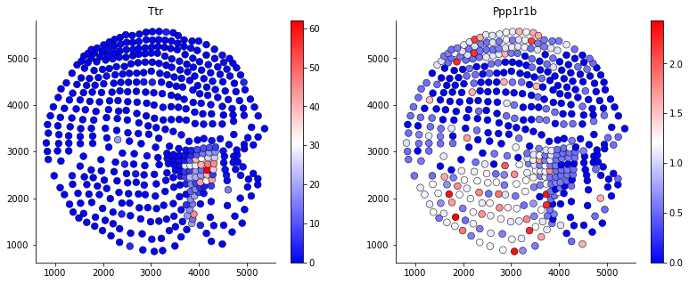
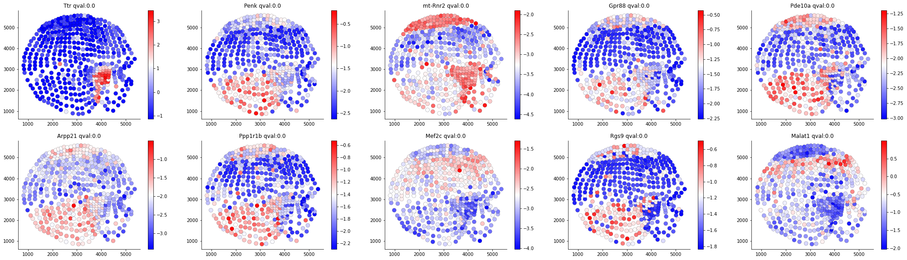
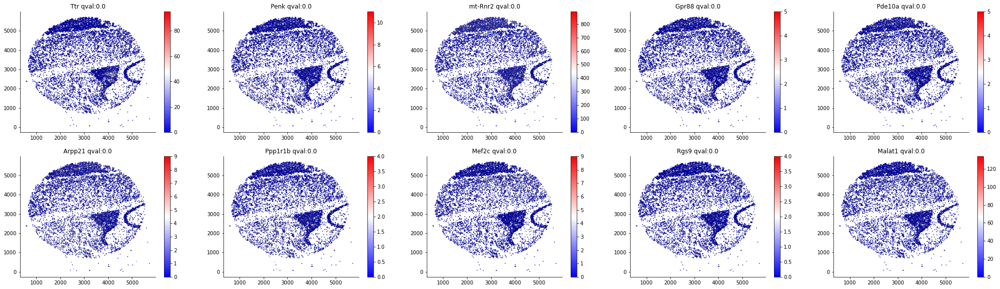

# SOMDE 
Algorithm for finding gene spatial pattern based on Gaussian process accelerated by SOM

## Install

```bash
conda install -c conda-forge somoclu
conda install pandas
conda install patsy
pip install somde
```

## Data
Slide-seq data we used can be downloaded from SpatialDB website:
http://www.spatialomics.org/SpatialDB/download.php

## Tutorial


### load data
```python
df = pd.read_csv(dataname+'count.csv',sep=',',index_col=1)
corinfo = pd.read_csv(dataname+'idx.csv',sep=',',index_col=0)
corinfo["total_count"]=df.sum(0)
X=corinfo[['x','y']].values.astype(np.float32)
```
After data loading, we can generate a SOM on the tissue spatial domain.
### build SOM
```python
from somde import SomNode
som = SomNode(X,20)
```
This step will initialize a SOM and train it. You can use `som.viewIniCodebook()`and`som.view()` to visualize the distribution of untrained and trained SOM nodes. Here is the result:




### integrate data sites and expression
```python
ndf,ninfo = som.mtx(df)
```
`mtx`function will generate pesudo gene expression and spatial data site information at reduced resolution. You can visualize the gene expreesion on the condensed map by using `plotgene`.



### normalize data and identify SVgenes
Since we integrated the original count data, we need to normalize gene expression matrix in each `SomNode` object.
```python
nres = som.norm()
result, SVnum =som.run()
```
The identification step is mainly based on the adjusted Gaussian Process, which was first proposed by [SpatialDE](https://github.com/Teichlab/SpatialDE). Here are the Top SVgenes given by SOMDE on both the original and SOM view:




More visualization results can be found at https://github.com/WhirlFirst/somde/blob/master/slide_seq0819_11_SOM.ipynb 


